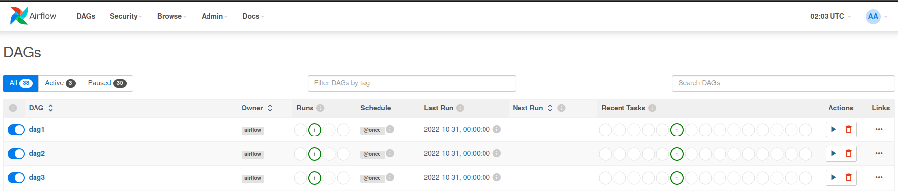

# Airflow Workshop_01 Code Documentation
Welcome to the iMarckDEV Blog Repository! This repository contains the source code for the [iMarckDEV blog site](https://www.imarck.dev), a platform dedicated to exploring cloud technologies, sharing tutorials, and providing valuable resources for developers.
## Description
This is a testing to play with apache AIRFLOW 2.0:
**Tools**:
+ Docker
+ Airflow

## Getting started

*Step 1*
In terminal get the docker compose `.yaml`
```batch
curl -LfO 'https://airflow.apache.org/docs/apache-airflow/2.3.3/docker-compose.yaml'
``` 

*Step 2*
Run the continer:
```batch
docker-compose up
``` 

Sometimes the code doesn't run the continer so try with this in linux's terminal :
```batch
mkdir -p ./dags ./logs ./plugins
echo -e "AIRFLOW_UID=$(id -u)" > .env
docker-compose up airflow-init
docker-compose up
``` 


It takes some time to up the continer then in your webbrowser at port 8080, will be the service.
```batch
http://localhost:8080/
``` 
And you'll find a login like this:


```batch
user:airlfow
pass:airflow
```

And will show you some DAGs preloaded.


So now to test another thing, list all the continers 
```batch
docker ps
```
and search the id of the webserver to get in and if you need change the `airflow.cfg` file:

```batch
docker exec -it id bash
```

Or change the configuration directly in the `yaml`

and for example a change could be, not get examples and less timming:

[ref](https://airflow.apache.org/docs/apache-airflow/stable/configurations-ref.html#webserver)

```yaml
AIRFLOW__CORE__DAGS_ARE_PAUSED_AT_CREATION: 'false'
AIRFLOW__SCHEDULER__DAG_DIR_LIST_INTERVAL: 100
```

## The DAGs
So lets create some dummy DAGS, in this case add a file .py in the folder dags:

+ 0-primerdag.py

```python
with DAG(
    dag_id="dag1",
    description="dag1",
    start_date=datetime(2022, 10, 31),
    schedule_interval="@once",
    ) as dag1:  
        op = EmptyOperator(task_id="dummy")
```

And those DAGs'll appear there:



## The pipeline


## Contributing

Thank you for your interest in contributing to the iMarckDEV Blog Repository. If you have any improvements or bug fixes, please feel free to submit a pull request. We appreciate your contributions!

## License

This project is licensed under the [MIT License](LICENSE). Feel free to use, modify, and distribute this code for personal or commercial purposes.

For more information, visit the [iMarckDEV blog site](https://www.imarck.dev) and explore other resources and tutorials. Happy coding!'''